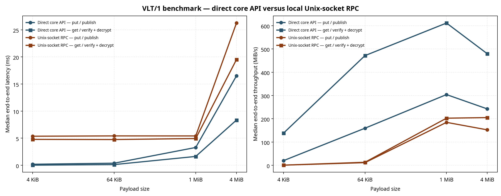

# VLT/1 benchmark report

**Author:** Itan Winter (NIxort) / Nixort  
**Recorded dataset:** `results/direct_rpc_benchmark_20260817.csv`  
**Median summary:** `results/direct_rpc_benchmark_20260817_summary.csv`  
**Chart:** `results/direct_rpc_benchmark_20260817.png`

## Scope and methodology

`vlt1-bench` measures two verified whole-vault operations. A `put` includes chunk encryption, Manifest sealing, DEK wrapping, the `SQLite` transaction, and active-pointer publication. A `get` includes SQLite reads, wrapped-DEK verification, Manifest authentication, digest verification, chunk authentication, and plaintext assembly. Every returned payload is compared with the deterministic source payload; a mismatch aborts the run.

The benchmark has two modes. **Direct** calls `Vault::put` and `Vault::get` in one process. **RPC** creates a fresh vault and an in-process `vlt1d`, unlocks it once outside the timed region, and measures one new Unix-socket connection for every `put` or `get`. Timed RPC `put` includes base64 encoding, framing, local connection setup, peer authorization, daemon dispatch, cryptographic/storage work, and response handling. Timed RPC `get` includes the inverse response path and base64 decoding. This is an end-to-end local-client measurement, not a pure cryptographic throughput number.

| Property | Value |
|---|---|
| Release command | `cargo run --release -p vlt1 --bin vlt1-bench -- --mode both --runs 5` |
| Payloads | 4 KiB, 64 KiB, 1 MiB, 4 MiB |
| Samples | Five samples per `(mode, operation, payload)` group |
| Summary statistic | Unweighted median from raw samples |
| KDF timing | Excluded: each vault is created and unlocked before timed samples |
| Concurrency | Excluded: benchmark uses one client operation at a time |
| Freshness witness | Excluded: ordinary `put` is measured |

## Recorded result

The recorded 2026-08-17 run used the following environment. Raw rows and computed medians are kept separately so the chart remains auditable.

| Provenance field | Recorded value |
|---|---|
| Rust / Cargo | `rustc 1.97.1`, `cargo 1.97.1` |
| Host | Linux `6.1.102`, AMD EPYC virtual CPU, six logical CPUs |
| Command | `cargo run --release -p vlt1 --bin vlt1-bench -- --mode both --runs 5` |
| Payloads | `4,64,1024,4096` KiB |
| Visual review | The 2396×938 PNG was checked for legible title, panels, log-scaled payload labels, legends, and axes without clipping. |

| Payload | Direct `put` ms | Direct `get` ms | RPC `put` ms | RPC `get` ms |
|---:|---:|---:|---:|---:|
| 4 KiB | 0.194 | 0.028 | 5.369 | 4.780 |
| 64 KiB | 0.392 | 0.133 | 5.423 | 4.752 |
| 1 MiB | 3.291 | 1.636 | 5.417 | 4.938 |
| 4 MiB | 16.500 | 8.344 | 26.242 | 19.504 |

The small-payload RPC latency is dominated by process-local socket setup, JSON/base64 framing, authorization, thread scheduling, and dispatch. As payload size increases, the fixed local-RPC overhead is amortized and verified encryption/storage work dominates more of the end-to-end time. These values are **machine-specific measurements**; they are not speed claims for AES-GCM-SIV, SQLite, Rust, or VLT/1 on other hardware.



## Reproduce

Run the production-profile benchmark and retain the emitted raw CSV unchanged:

```sh
cd /path/to/vlt1
cargo run --release -p vlt1 --bin vlt1-bench -- \
  --mode both --payloads-kib 4,64,1024,4096 --runs 5 \
  > results/direct_rpc_benchmark.csv

python3 scripts/plot_benchmarks.py results/direct_rpc_benchmark.csv \
  --output results/direct_rpc_benchmark.png \
  --summary results/direct_rpc_benchmark_summary.csv
```

Record host, toolchain, command, payloads, and visual-review status with the release result. The plotting script accepts only the exact six-column raw schema emitted by `vlt1-bench`, calculates medians from observed rows, and does not synthesize, smooth, interpolate, or replace samples.

## Interpretation and limits

The chart is a regression and sizing signal for the implemented local service boundary. It does not demonstrate cryptographic security, crash consistency under physical power loss, resistance to rollback, side-channel resistance, performance under concurrent daemon clients, external-witness latency, or full-disk encryption performance. Storage hardware, filesystem semantics, CPU frequency policy, virtual-machine contention, memory pressure, compiler version, and the release profile materially affect outcomes.

When changing encryption, parser behavior, transaction boundaries, IPC framing, daemon scheduling, storage layout, or allocation behavior, rerun the exact benchmark and retain both the former and new raw CSVs with a short explanation of the change.
